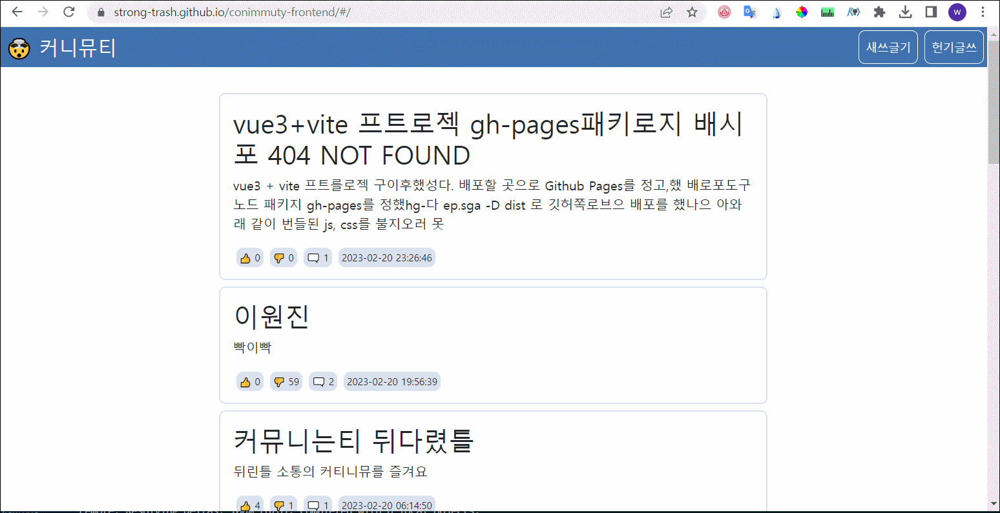

# 🤯 커니뮤티 : 프론트엔드

쓰레기톡 주관 `<제1회 밤새서 쓸모없는 프로그램 만들기 행사>`의 산출물, **커니뮤티**의 프론트엔드 프로그램입니다.
* 백엔드 프로그램은 [riroan](https://github.com/riroan)이 만들었고, 레포지토리는 [여기](https://github.com/strong-trash/conimmuty-backend)있습니다.

**커니뮤티**는 최첨단 보안기술 '유저정보 저장 안하기'를 적용한 뒤틀리고 왜곡된 소통을 지향하는 완벽한 익명 커뮤니티입니다.



### 주요 기능

* **새 글**을 쓸 수 있습니다. 쓰던 글은 30초마다, 혹은 '새쓰글기' 페이지를 벗어나면 **헌 글**로 자동저장됩니다.
* **헌 글**을 바탕으로 글을 이어 쓸 수 있습니다.
* 남이 쓴 이상한 글을 읽고 **추천, 반대**를 하거나 의도치 않게 이상한 댓글을 달 수 있습니다.

### 특징

* 🤯🤯🤯 **작성한 모든 텍스트**는 [riroan](https://github.com/riroan)이 다년간 개발했는지 잘 모르겠지만 아무튼 **특수목적 문장 곡해 시스템에 의해 변형될 수도 있습니다.** 🤯🤯🤯
* **한 번 뱉은 말은 절대 주워담거나 고칠 수 없습니다.** 의도치 않은 문장이 완성되더라도 그렇습니다. 언제나 말 한 마디 한 마디에 조심해야 함을 일깨우기 위함입니다.
* 작성자가 누구인지에 대해 누구도 알 수 없으며, 개인정보가 유출될 위험도 없습니다. 신뢰할 수 있는 최첨단 익명보장 시스템을 제공합니다.
* 추천과 비추천은 무한히 누를 수 있습니다. 여론조작을 적극적으로 권장합니다.

### 프론트엔드 사용 기술

* Vue 3 + Vite + vue-router + eslint + prettier
* axios
* bootstrap (input component)
* gh-pages

### 프로젝트 src 디렉토리 구조

src 디렉토리는 아래와 같은 하위 구조를 가집니다.

```
[assets]
└─ [apis] : 반복적으로 사용하는 스크립트의 모음입니다.
    └─ request.js : 백엔드로 자원을 요청하는 스크립트
    └─ yameStorage.js : 작성중인 글을 '헌 글'로 임시저장하는 스크립트

[components]
└─ [atoms] : 하위컴포넌트가 없는 최소단위 컴포넌트들이 있습니다. (버튼, 게시글, 댓글)
└─ [layouts] : 큼직한 레이아웃 컴포넌트들이 있습니다. (헤더, 뷰)

[views] : (View Router에 의해 보여질 View컴포넌트들이 있습니다.)

main.js : 뷰를 구동하는 진입점입니다.
App.vue : 루트 컴포넌트입니다.
router.js : vue-router 작동을 위한 설정을 기술한 파일입니다.
```

### 컴포넌트 계층

아래와 같이 컴포넌트가 구성되어 있습니다.
```
APP
└─ TheHeader
└─ TheView
    └─ (RouterView)
```

RouterView는 아래 다섯 가지의 View컴포넌트를 표시합니다.
```
MainView : 메인화면입니다. 모든 게시글을 보여줍니다.
DetailView : 특정 게시글의 전체 내용과 댓글을 보여줍니다.
NewPostView : 백지 상태에서 또는 헌 글을 바탕으로 게시글을 작성할 수 있는 뷰입니다.
OldPostView : 헌 글의 목록을 보여줍니다. 
              특정 항목을 선택해 헌 글을 바탕으로 게시글을 작성하는 NewPostView로 이동합니다.
NotFoundView : 404코드를 받으면 보여주는 화면입니다.
```